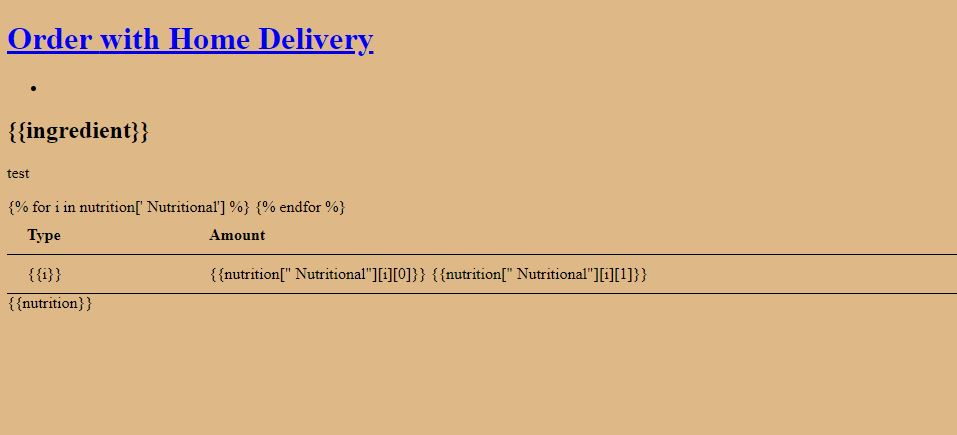
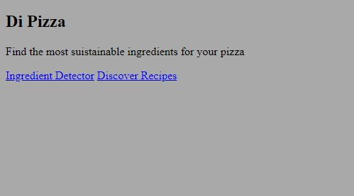

# HackZurich
Lets hack some pizzasss

# Dependencies

- pip install requests
- python -m pip install 'mongo[srv]' dnspython
- pip install pymongo
- pip install tqdm

# Run the backend

- export FLASK_APP=backend.py
- python -m flask run

## Screenshots of Web Application

<table align="center">
<tr>
     <td>
         
     	</td>
     	<td>
         
     	</td>
</tr>
</table>
